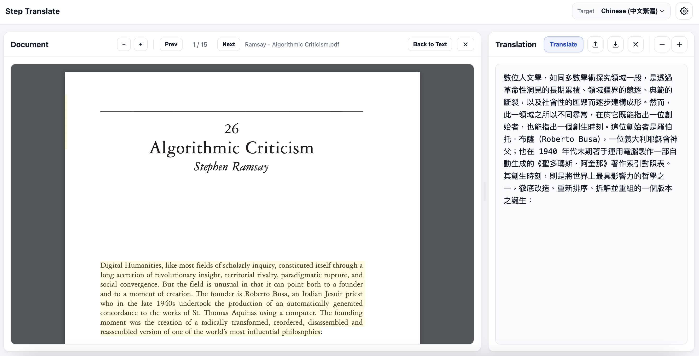

# Step Translate

A lightweight web app for translating documents passage-by-passage. Upload PDF, TXT, or DOCX files and translate selected text with context-aware translation.

*Select text directly in a PDF and translate it:*



*Or choose a passage and insert the translation at a specific location:*


## Features

- Upload and view PDF, TXT, and DOCX documents
- Click passages to select (Cmd/Ctrl+click for multi-select)
- Translate selected text into any language supported by the endpoint's model
- Context-aware translation using prior translations for consistency
- Configurable context limits (by passages or characters)
- Customizable prompts and temperature via Settings UI
- Download translations as TXT, PDF, or DOCX files

## Setup

```bash
# Create virtual environment and install dependencies
python3 -m venv venv
source venv/bin/activate
pip install -r requirements.txt

# Configure environment (optional - can also configure via Settings UI)
cp .env.example .env
# Edit .env with your API_KEY

# Start server
./start.sh        # Uses PORT from .env (default: 6969)
./start.sh 8080   # Or specify port as argument
```

Open http://127.0.0.1:6969 in your browser.

Stop the server with `./stop.sh`.

## Configuration

### Environment Variables (`.env`)

- `API_KEY` - Your OpenAI or compatible API key
- `API_ENDPOINT` - API endpoint (default: `https://api.openai.com/v1`)
- `MODEL` - Model name (default: `gpt-5.2`)
- `PORT` - Server port (default: `6969`)
- `MAX_UPLOAD_MB` - Maximum upload file size in MB (default: `50`)
- `CLEANUP_UPLOADS_DAYS` - Auto-delete uploads older than N days (default: `7`, `0` = keep forever)
- `CLEANUP_LOGS_DAYS` - Auto-delete logs older than N days (default: `30`, `0` = keep forever)

### Prompt Templates (`prompts.json`)

Edit `prompts.json` to customize translation prompts and default temperature. Users can also override these in the Settings UI.

## License

MIT
